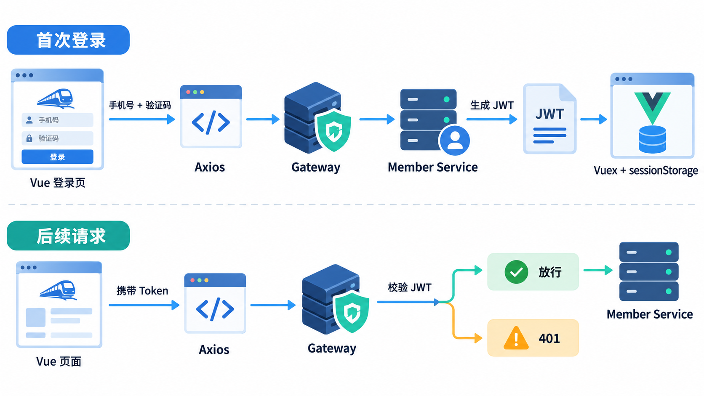

# Vue 3 + Spring Boot 仿 12306：前端搭建与 JWT 单点登录

> 原文：[Java项目实战笔记——基于 Spring Boot 3.0 开发仿 12306 高并发售票系统（二）](https://blog.csdn.net/m0_52620144/article/details/136714981)
>
> 原作者：NEIL_XU_ ｜ 首发：2024-03-14 ｜ 更新：2024-03-15
>
> 原文声明采用 [CC BY-SA 4.0](https://creativecommons.org/licenses/by-sa/4.0/) 许可。本文是根据原文主题重新编写的学习笔记，代码也经过整理和简化，并非原文逐字镜像。完整原文、原始代码和截图请通过上方链接查看。



## 1. 最终实现效果

本节完成一条可运行的登录链路：

1. Vue 3 页面收集手机号与短信验证码。
2. Axios 调用 Spring Boot 会员服务。
3. 登录成功后，后端生成 JWT。
4. 前端将会员信息保存在 Vuex 与 `sessionStorage`。
5. 后续请求自动携带 token。
6. Spring Cloud Gateway 校验 JWT，无效时返回 401。
7. Axios 响应拦截器收到 401 后清理状态并跳转登录页。
8. Vue Router 路由守卫阻止未登录用户进入控制台。

## 2. 创建 Vue 3 工程

建议使用 Node.js 18 或更高版本，并使用 Vue CLI 5 创建工程。

```shell
npm config set registry https://registry.npmmirror.com
npm install -g @vue/cli@5.0.8
vue create web
cd web
npm run serve
```

安装页面组件、图标与 HTTP 客户端：

```shell
npm install ant-design-vue@3.2.15
npm install @ant-design/icons-vue
npm install axios
```

## 3. 注册 Ant Design Vue 与 Axios 拦截器

文件：`web/src/main.js`

```javascript
import { createApp } from 'vue';
import Antd, { notification } from 'ant-design-vue';
import * as Icons from '@ant-design/icons-vue';
import axios from 'axios';

import 'ant-design-vue/dist/antd.css';
import App from './App.vue';
import router from './router';
import store from './store';

axios.defaults.baseURL = process.env.VUE_APP_SERVER;

axios.interceptors.request.use(
  (config) => {
    const token = store.state.member?.token;
    if (token) {
      config.headers.Authorization = `Bearer ${token}`;
    }
    return config;
  },
  (error) => Promise.reject(error),
);

axios.interceptors.response.use(
  (response) => response,
  (error) => {
    if (error.response?.status === 401) {
      store.commit('setMember', {});
      notification.error({ description: '未登录或登录已过期' });
      router.push('/login');
    }
    return Promise.reject(error);
  },
);

const app = createApp(App);
Object.entries(Icons).forEach(([name, component]) => {
  app.component(name, component);
});

app.use(Antd).use(store).use(router).mount('#app');
```

## 4. 配置开发与生产环境

文件：`web/.env.dev`

```dotenv
NODE_ENV=development
VUE_APP_SERVER=http://localhost:8000
```

文件：`web/.env.prod`

```dotenv
NODE_ENV=production
VUE_APP_SERVER=https://example.com
```

文件：`web/package.json` 中的脚本片段：

```json
{
  "scripts": {
    "serve-dev": "vue-cli-service serve --mode dev --port 9000",
    "serve-prod": "vue-cli-service serve --mode prod --port 9000"
  }
}
```

## 5. 登录页面

文件：`web/src/views/login.vue`

```vue
<template>
  <a-row class="login-page">
    <a-col :xs="22" :sm="14" :md="8" :lg="6" class="login-card">
      <h1><rocket-two-tone /> 12306 售票系统</h1>

      <a-form :model="form" layout="vertical">
        <a-form-item
          name="mobile"
          :rules="[{ required: true, message: '请输入手机号' }]"
        >
          <a-input v-model:value="form.mobile" placeholder="手机号" />
        </a-form-item>

        <a-form-item
          name="code"
          :rules="[{ required: true, message: '请输入验证码' }]"
        >
          <a-input v-model:value="form.code" placeholder="验证码">
            <template #addonAfter>
              <a @click="sendCode">获取验证码</a>
            </template>
          </a-input>
        </a-form-item>

        <a-button type="primary" block @click="login">登录</a-button>
      </a-form>
    </a-col>
  </a-row>
</template>

<script>
import { defineComponent, reactive } from 'vue';
import { notification } from 'ant-design-vue';
import axios from 'axios';
import { useRouter } from 'vue-router';
import store from '@/store';

export default defineComponent({
  name: 'LoginView',
  setup() {
    const router = useRouter();
    const form = reactive({ mobile: '', code: '' });

    const sendCode = async () => {
      const { data } = await axios.post('/member/member/send-code', {
        mobile: form.mobile,
      });
      if (data.success) {
        notification.success({ description: '验证码发送成功' });
      } else {
        notification.error({ description: data.message });
      }
    };

    const login = async () => {
      const { data } = await axios.post('/member/member/login', form);
      if (!data.success) {
        notification.error({ description: data.message });
        return;
      }
      store.commit('setMember', data.content);
      notification.success({ description: '登录成功' });
      await router.push('/');
    };

    return { form, sendCode, login };
  },
});
</script>

<style scoped>
.login-page {
  min-height: 100vh;
  align-items: flex-start;
  justify-content: center;
  background: #f5f7fa;
}

.login-card {
  margin-top: 100px;
  padding: 30px;
  border: 1px solid #d9d9d9;
  border-radius: 10px;
  background: #fff;
}

.login-card h1 {
  margin-bottom: 28px;
  text-align: center;
  font-size: 24px;
}
</style>
```

## 6. Vuex 与会话缓存

文件：`web/public/js/session-storage.js`

```javascript
window.SessionStorage = {
  get(key) {
    const value = sessionStorage.getItem(key);
    return value ? JSON.parse(value) : undefined;
  },
  set(key, data) {
    sessionStorage.setItem(key, JSON.stringify(data));
  },
  remove(key) {
    sessionStorage.removeItem(key);
  },
  clearAll() {
    sessionStorage.clear();
  },
};
```

在 `web/public/index.html` 中引入：

```html
<script src="<%= BASE_URL %>js/session-storage.js"></script>
```

文件：`web/src/store/index.js`

```javascript
import { createStore } from 'vuex';

const MEMBER_KEY = 'MEMBER';

export default createStore({
  state: {
    member: window.SessionStorage.get(MEMBER_KEY) || {},
  },
  mutations: {
    setMember(state, member) {
      state.member = member;
      window.SessionStorage.set(MEMBER_KEY, member);
    },
  },
});
```

## 7. 路由与登录守卫

文件：`web/src/router/index.js`

```javascript
import { createRouter, createWebHistory } from 'vue-router';
import { notification } from 'ant-design-vue';
import store from '@/store';

const routes = [
  {
    path: '/login',
    component: () => import('../views/login.vue'),
  },
  {
    path: '/',
    component: () => import('../views/main.vue'),
    meta: { loginRequired: true },
  },
];

const router = createRouter({
  history: createWebHistory(process.env.BASE_URL),
  routes,
});

router.beforeEach((to) => {
  const needsLogin = to.matched.some(
    (record) => record.meta.loginRequired,
  );
  if (needsLogin && !store.state.member?.token) {
    notification.error({ description: '请先登录' });
    return '/login';
  }
  return true;
});

export default router;
```

## 8. 后端请求与响应对象

发送验证码请求：

```java
package com.example.train.member.req;

import jakarta.validation.constraints.NotBlank;
import jakarta.validation.constraints.Pattern;
import lombok.Data;

@Data
public class MemberSendCodeReq {
    @NotBlank(message = "手机号不能为空")
    @Pattern(regexp = "^1\\d{10}$", message = "手机号格式错误")
    private String mobile;
}
```

登录请求：

```java
package com.example.train.member.req;

import jakarta.validation.constraints.NotBlank;
import jakarta.validation.constraints.Pattern;
import lombok.Data;

@Data
public class MemberLoginReq {
    @NotBlank(message = "手机号不能为空")
    @Pattern(regexp = "^1\\d{10}$", message = "手机号格式错误")
    private String mobile;

    @NotBlank(message = "验证码不能为空")
    private String code;
}
```

登录响应：

```java
package com.example.train.member.resp;

import lombok.Data;

@Data
public class MemberLoginResp {
    private Long id;
    private String mobile;
    private String token;
}
```

## 9. Controller 接口

```java
@RestController
@RequestMapping("/member")
@RequiredArgsConstructor
public class MemberController {

    private final MemberService memberService;

    @PostMapping("/send-code")
    public CommonResp<Void> sendCode(
            @Valid @RequestBody MemberSendCodeReq request) {
        memberService.sendCode(request);
        return CommonResp.success();
    }

    @PostMapping("/login")
    public CommonResp<MemberLoginResp> login(
            @Valid @RequestBody MemberLoginReq request) {
        return CommonResp.success(memberService.login(request));
    }
}
```

测试请求：

```http
POST http://localhost:8000/member/member/send-code
Content-Type: application/json

{
  "mobile": "13000000001"
}

###

POST http://localhost:8000/member/member/login
Content-Type: application/json

{
  "mobile": "13000000001",
  "code": "8888"
}
```

## 10. 会员服务

下面是简化的教学实现。固定验证码仅用于本地演示，不能用于生产环境。

```java
@Service
@RequiredArgsConstructor
public class MemberService {

    private static final String DEMO_CODE = "8888";
    private final MemberMapper memberMapper;

    public void sendCode(MemberSendCodeReq request) {
        Member member = memberMapper.selectByMobile(request.getMobile());
        if (member == null) {
            member = new Member();
            member.setId(IdGenerator.nextId());
            member.setMobile(request.getMobile());
            memberMapper.insert(member);
        }
        // 生产环境：生成随机验证码，写入 Redis，并调用短信服务。
    }

    public MemberLoginResp login(MemberLoginReq request) {
        Member member = memberMapper.selectByMobile(request.getMobile());
        if (member == null) {
            throw new BusinessException("请先获取短信验证码");
        }
        if (!DEMO_CODE.equals(request.getCode())) {
            throw new BusinessException("短信验证码错误");
        }

        MemberLoginResp response =
                BeanUtil.copyProperties(member, MemberLoginResp.class);
        response.setToken(
                JwtUtil.createToken(member.getId(), member.getMobile())
        );
        return response;
    }
}
```

## 11. JWT 工具类

```java
public final class JwtUtil {

    private static final byte[] KEY = requireKey();
    private static final Duration TTL = Duration.ofHours(2);

    private JwtUtil() {
    }

    public static String createToken(Long id, String mobile) {
        Date now = new Date();
        Date expiresAt = new Date(now.getTime() + TTL.toMillis());

        Map<String, Object> payload = new HashMap<>();
        payload.put(JWTPayload.ISSUED_AT, now);
        payload.put(JWTPayload.NOT_BEFORE, now);
        payload.put(JWTPayload.EXPIRES_AT, expiresAt);
        payload.put("id", id);
        payload.put("mobile", mobile);

        return JWTUtil.createToken(payload, KEY);
    }

    public static boolean validate(String token) {
        try {
            return JWTUtil.parseToken(token).setKey(KEY).validate(0);
        } catch (RuntimeException exception) {
            return false;
        }
    }

    private static byte[] requireKey() {
        String value = System.getenv("TRAIN_JWT_SECRET");
        if (value == null || value.length() < 32) {
            throw new IllegalStateException(
                    "TRAIN_JWT_SECRET must contain at least 32 characters"
            );
        }
        return value.getBytes(StandardCharsets.UTF_8);
    }
}
```

PowerShell 测试环境变量：

```powershell
$env:TRAIN_JWT_SECRET = 'replace-with-a-long-random-secret-value'
```

## 12. Gateway 跨域配置

```properties
spring.cloud.gateway.globalcors.cors-configurations.[/**].allowedOriginPatterns=http://localhost:9000
spring.cloud.gateway.globalcors.cors-configurations.[/**].allowedHeaders=*
spring.cloud.gateway.globalcors.cors-configurations.[/**].allowedMethods=GET,POST,PUT,DELETE,OPTIONS
spring.cloud.gateway.globalcors.cors-configurations.[/**].allowCredentials=true
spring.cloud.gateway.globalcors.cors-configurations.[/**].maxAge=3600
```

## 13. Gateway 登录过滤器

```java
@Component
public class LoginMemberFilter implements GlobalFilter, Ordered {

    private static final Set<String> PUBLIC_PATHS = Set.of(
            "/member/member/login",
            "/member/member/send-code"
    );

    @Override
    public Mono<Void> filter(
            ServerWebExchange exchange,
            GatewayFilterChain chain) {

        String path = exchange.getRequest().getURI().getPath();
        if (PUBLIC_PATHS.contains(path)) {
            return chain.filter(exchange);
        }

        String authorization = exchange.getRequest()
                .getHeaders()
                .getFirst(HttpHeaders.AUTHORIZATION);
        String token = extractBearerToken(authorization);

        if (token == null || !JwtUtil.validate(token)) {
            exchange.getResponse().setStatusCode(HttpStatus.UNAUTHORIZED);
            return exchange.getResponse().setComplete();
        }
        return chain.filter(exchange);
    }

    private String extractBearerToken(String authorization) {
        String prefix = "Bearer ";
        if (authorization == null || !authorization.startsWith(prefix)) {
            return null;
        }
        return authorization.substring(prefix.length());
    }

    @Override
    public int getOrder() {
        return 0;
    }
}
```

## 14. 控制台主页示例

```vue
<template>
  <a-layout class="page">
    <a-layout-header class="header">
      <strong>12306 售票系统</strong>
      <span>您好：{{ member.mobile }}</span>
    </a-layout-header>

    <a-layout>
      <a-layout-sider theme="light">
        <a-menu mode="inline" :selected-keys="['dashboard']">
          <a-menu-item key="dashboard">控制台</a-menu-item>
        </a-menu>
      </a-layout-sider>

      <a-layout-content class="content">
        <a-card title="会员统计">所有会员总数：{{ count }}</a-card>
      </a-layout-content>
    </a-layout>
  </a-layout>
</template>

<script>
import { defineComponent, onMounted, ref } from 'vue';
import axios from 'axios';
import store from '@/store';

export default defineComponent({
  name: 'MainView',
  setup() {
    const count = ref(0);
    const member = store.state.member;
    onMounted(async () => {
      const { data } = await axios.get('/member/member/count');
      if (data.success) count.value = data.content;
    });
    return { count, member };
  },
});
</script>
```

## 15. 开发服务器 401 遮罩处理

```javascript
const { defineConfig } = require('@vue/cli-service');

module.exports = defineConfig({
  transpileDependencies: true,
  devServer: {
    client: {
      overlay: false,
    },
  },
});
```

该设置只影响开发界面，不能代替正确的 Promise 异常处理。

## 16. 项目文件索引

| 模块 | 文件或类 | 用途 |
|---|---|---|
| Web | `src/main.js` | UI 注册、Axios 配置、401 处理 |
| Web | `src/views/login.vue` | 验证码与登录页面 |
| Web | `src/views/main.vue` | 控制台页面 |
| Web | `src/router/index.js` | 路由和登录守卫 |
| Web | `src/store/index.js` | 会员状态 |
| Web | `public/js/session-storage.js` | 会话缓存包装 |
| Member | `MemberController` | HTTP 接口 |
| Member | `MemberService` | 会员、验证码和登录逻辑 |
| Common | `JwtUtil` | JWT 签发与验证 |
| Gateway | `LoginMemberFilter` | 网关统一鉴权 |

## 17. 原文图片内容索引

原博客截图覆盖以下内容。本文使用上方原创流程图，并保留[原文入口](https://blog.csdn.net/m0_52620144/article/details/136714981)供查看原始截图：

1. Node.js、Vue CLI 和 IDEA 环境配置。
2. Ant Design Vue 按钮、图标测试。
3. 手机号与验证码登录页。
4. 验证码和登录接口调试结果。
5. Axios 跨域错误及修复后的请求结果。
6. 控制台顶部导航、侧边栏和内容区。
7. JWT、Vuex 和会话缓存测试。
8. Gateway 过滤器执行日志。
9. 401 错误页面与路由守卫测试。

## 18. 生产环境安全事项

- 验证码应随机生成，保存在 Redis，并设置短有效期、一次性使用和错误次数限制。
- 对验证码与登录接口增加 IP、设备、手机号维度的限流。
- JWT 密钥必须由安全配置注入，并制定过期、刷新、撤销和轮换策略。
- 优先采用标准 `Authorization: Bearer` 请求头。
- 网关白名单采用精确匹配，避免宽泛的字符串包含判断。
- CORS 只允许可信前端域名、必要方法和必要请求头。
- 前端守卫不是安全边界，所有敏感接口都必须在服务端鉴权。
- 对日志中的手机号和 token 做脱敏，不要输出完整凭据。

## 参考链接

- [原始 CSDN 博客](https://blog.csdn.net/m0_52620144/article/details/136714981)
- [CC BY-SA 4.0](https://creativecommons.org/licenses/by-sa/4.0/)
- 原文参考的慕课网课程链接可在原博客开头找到。
